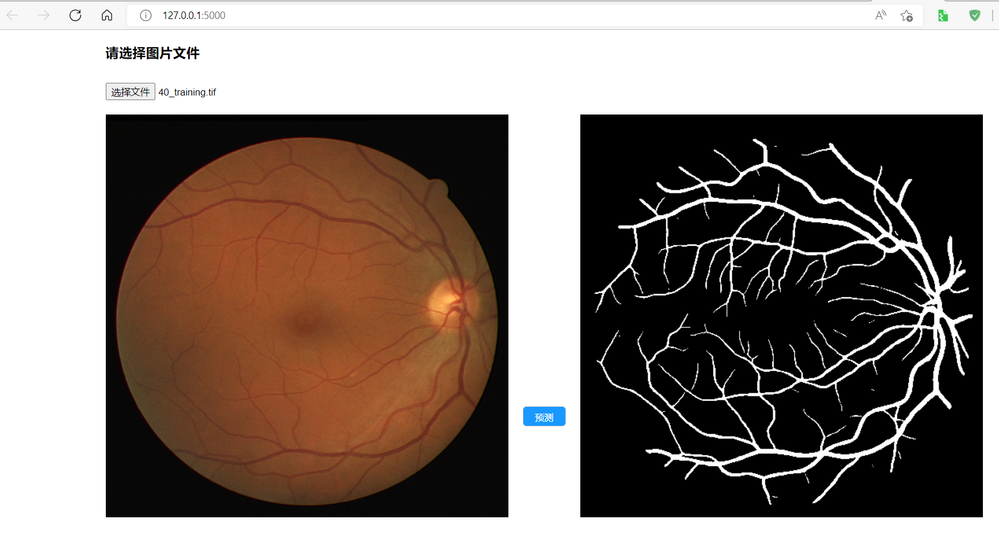

## 使用Flask+html前后端分离部署pytorch模型demo
***
### 后端使用Flask，前端使用html+jquery框架。
***
#### **image_to_image**是从图片到图片的模型，类如分割模型、图像增强的模型。
* 当前的网页效果展示：
  


#### **image_to_words**是从图片到文本的模型，类如分类模型。
> **待完善中**
***

* 文件树
```
│  .gitignore
│  LICENSE
│  readme.md
│  
├─image_to_image
│  │  detect.py
│  │  main.py
│  │  model.py
│  │  
│  ├─static
│  │  └─js
│  │          jquery.min.js
│  │          
│  └─templates
│         main.html
│         test.html
│          
├─image_to_words
│  │  class_indices.json
│  │  main.ipynb
│  │  main.py
│  │  model.py
│  │  
│  ├─static
│  │  └─js
│  │          jquery.min.js
│  │          
│  └─templates
│          up.html
│          
└─img
        img1.png
```
